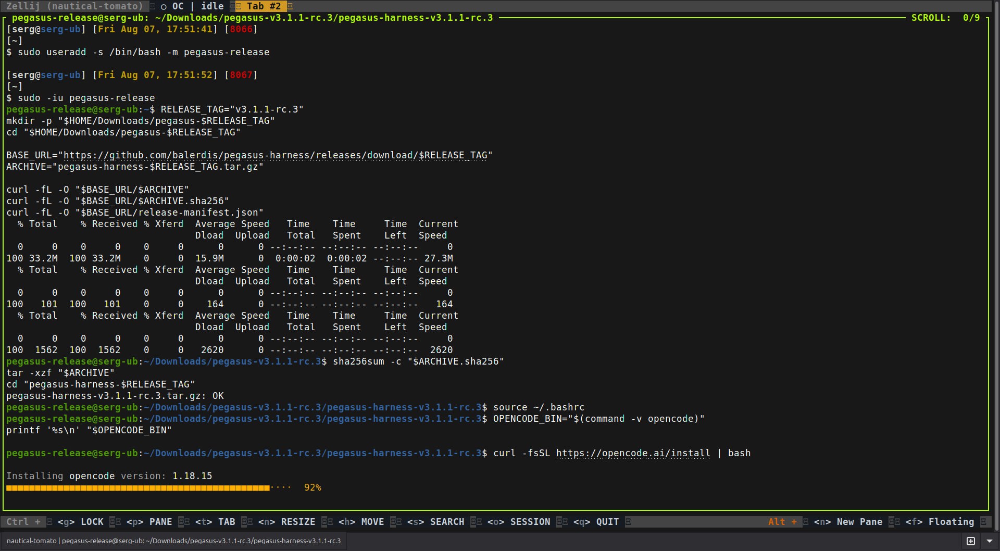
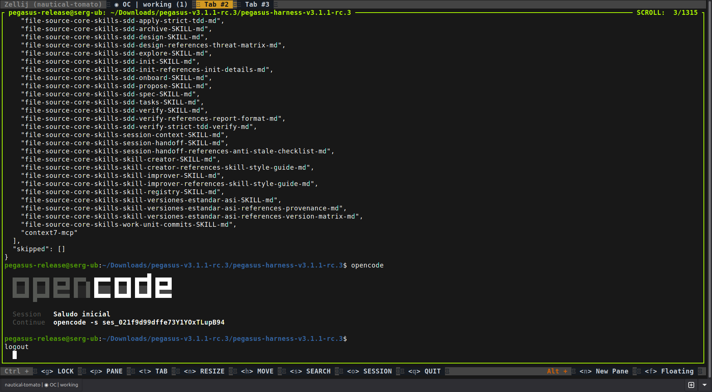
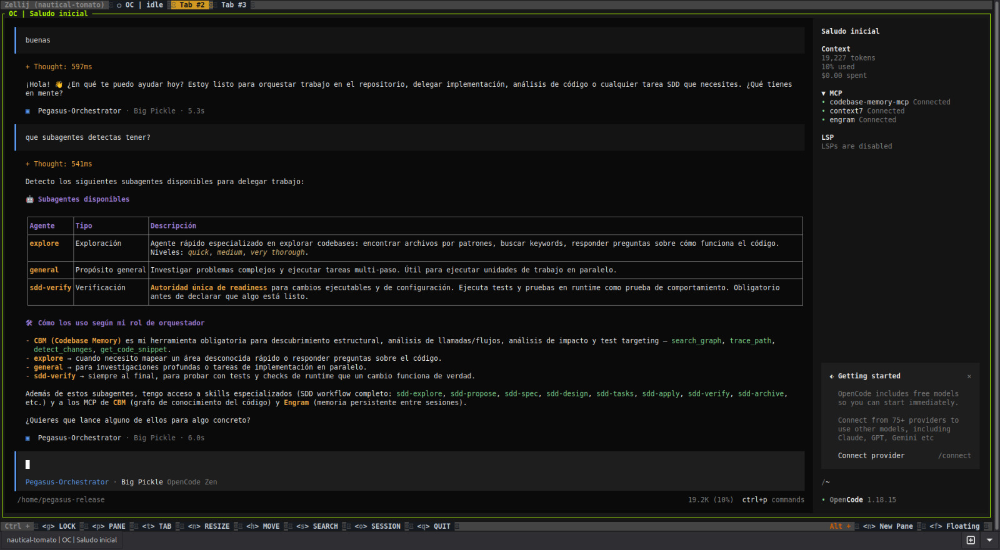

# Pegasus Harness v3.1

Pegasus Harness es un conjunto open source con licencia MIT de prompts, agentes, skills, comandos e integraciones opcionales para trabajar con OpenCode de forma más ordenada. Sirve para distintos clientes y repositorios: el flujo queda en manos del equipo que lo usa, no de una configuración particular de cliente.

Pegasus es aditivo. Revisa lo que ya existe, muestra un plan y crea solamente los artifacts seleccionados que faltan. No toma propiedad de una instalación existente de OpenCode, su configuración ni sus archivos.

## Instalación

### Con instalador

Seguí [INSTALL.md](INSTALL.md) para instalar Pegasus en la cuenta Linux actual.

### Con un agente

Usá [INSTALL_BY_AGENT.md](INSTALL_BY_AGENT.md) si un agente va a inspeccionar el checkout, preparar el plan y pedirte cada decisión pendiente.

## Qué incluye

Pegasus distribuye un payload seleccionado para OpenCode, no un home directory de reemplazo:

- comandos para SDD, contexto, handoff, creación y registro de skills;
- el orquestador de Pegasus y sus roles de implementación/verificación;
- skills reutilizables y sus referencias;
- plugins locales seleccionados e integraciones opcionales CBM, Engram, Playwright y Context7 cuando se confirman.

## Cómo encaja el flujo

La versión corta es: primero entender, después especificar, implementar por unidades chicas y probar el resultado. [architecture.md](architecture.md) explica las responsabilidades de SDD, TDD, OpenSpec, Engram y ChainPR sin esconder los límites operativos.

Para cambios ejecutables o de configuración, `sdd-verify` es la autoridad final de readiness. CBM ayuda a descubrir estructura y callers; no reemplaza una prueba de comportamiento que pasó.

## Prerrequisitos de OpenCode

Para `--client opencode`, necesitás Python 3.12+ y OpenCode instalado previamente en la cuenta Linux actual. Si vas a confirmar CBM, verificá que `codebase-memory-mcp --version` y `codebase-memory-mcp --help` respondan desde el ejecutable local. Playwright necesita un navegador compatible instalado por separado antes del apply; Pegasus no descarga navegadores.

Pegasus no configura credenciales, proveedor ni modelo: usá `/connect` para las credenciales del proveedor y `/models` para elegir el modelo.

La ruta asistida por agente empieza en [INSTALL_BY_AGENT.md](INSTALL_BY_AGENT.md): verifica los assets finales sin leer la configuración de OpenCode y solicita una decisión independiente para cada MCP.

## Validar un checkout

```sh
python3 tools/validate_snapshot.py
python3 -m unittest discover -s tests
python3 -m py_compile bin/pegasus tools/*.py
bash -n install.sh
```

Estos checks validan este checkout; no instalan OpenCode ni cambian tu configuración hasta que ejecutes el instalador.

## Licencia

Pegasus Harness se distribuye bajo la [licencia MIT](LICENSE).

## Capturas

Las capturas muestran la validación de instalación sobre `v3.1.1-rc.3` y el resultado en OpenCode.

### Instalación verificada



### Payload aplicado



### Pegasus en OpenCode


